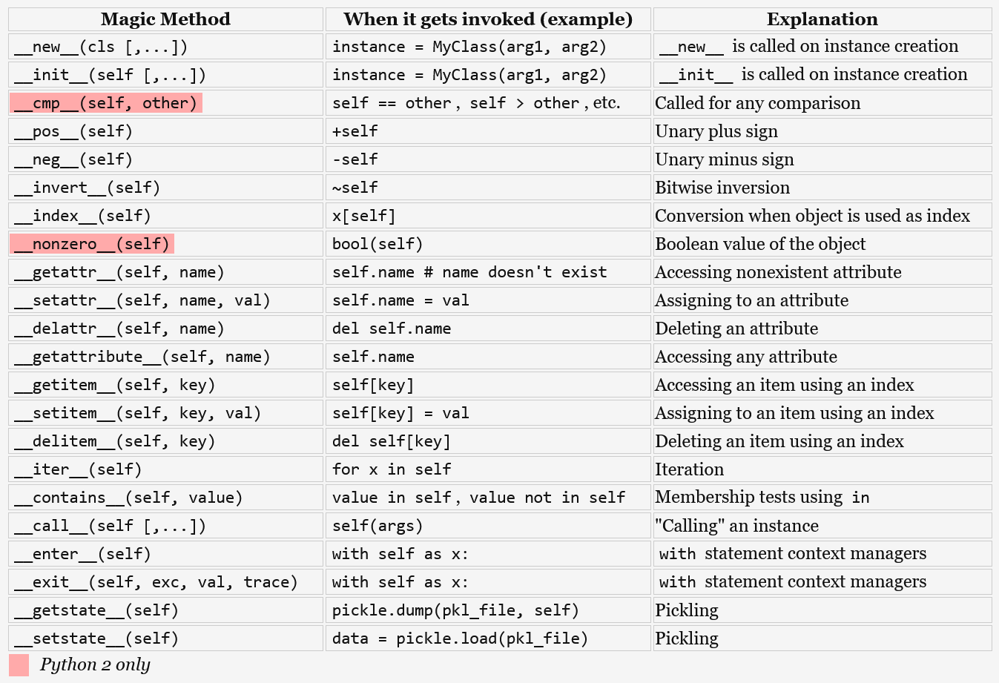

# Object Oriented Programming

Object Oriented Programming (OOP) allows programmers to create their own objects that have methods and attributes. In general, OOP allows to create code that is repeatable and organized

```python
class Dog():

  # Class Object Attribute, same for any instance of Class
  species = 'mammal'
  
  # constructor, always called when class is created
  # self references the instance being created
  def __init__(self, breed, name):
      # Attributes
      self.breed = breed
      self.name = name
  
  # method
  # self connects the instance with the method
  # Dog.attribute is usually used to access class object attribute, but it is possible to use self also
  def bark(self, number = 1):
    for _ in range(number): 
      print(f'WooF! My name is {self.name} and I my specie is {Dog.species}')

  def get_name(self):
    return self.name


my_dog1 = Dog(breed='Lab', name='Farofa')
my_dog2 = Dog('Canine', 'Fox')

my_dog1.bark()
my_dog2.bark(3)
```

## Inheritance
---
Inheritance allows us to define a class that inherits all the methods and properties from another class.

```python
# Base Class
class Animal():
  
  def __init__(self):
    print('Animal Created')
  
  def who_am_i(self):
    print('I am an animal')

  def eat(self):
    print('I am eating')

# Child Class
# The inheritance is defined passing the class inside the parenthesis during class declaration
class Dog(Animal):

  # overwrites parent constructor
  def __init__(self):
    # since parent constructor was overwrote it is necessary to invoke it using
    # the super() method. Super() return the reference of the parent class
    super().__init__()
    # Another way to do it is:
    # Animal.__init__(self)
    print('Dog Created')

  # overwrites method
  def who_am_i(self):
    print('I am a dog!')

  def bark(self):
    print('Woof!')
```

## Polymorphism
---
Allows to use the same method name with different behavior

```python
# Base Class / Abstract Class
class Animal:

  def __init__(self, name):
      self.name = name

  def speak(self):
    raise NotImplementedError('Subclass must implement this abstract method')

# Dog Class / Implements Animal
class Dog(Animal):

  def __init__(self, name):
      super().__init__(name)

  def speak(self):
      return f'{self.name} says bark!'

# Cat Class / Implements Animal
class Cat(Animal):

  def __init__(self, name):
      super().__init__(name)

  def speak(self):
      return f'{self.name} says meow!'

# Creates instances
dog, cat = Dog('Farofa'), Cat('Simba')

# Polymorphism
def pet_speak(pet):
  print(pet.speak())

for e in [dog, cat]:
  pet_speak(e)

```

## Magic Methods / Dunder Methods
---

Magic methods in Python are the special methods that start and end with the double underscores. They are also called dunder methods. Magic methods are not meant to be invoked directly by you, but the invocation happens internally from the class on a certain action. For example, when you add two numbers using the + operator, internally, the `__add__`() method will be called. Other example will be when the print method is invoked passing a custom object.

Ex.



```python
class Book:

  def __init__(self, title, author, pages):
    self.title = title
    self.author = author
    self.pages = pages

  def __str__(self):
    return f'{self.title} by {self.author}'

  def __len__(self):
    return self.pages

  def __del__(self):
    print('A book object has been deleted')

b = Book('Python Rocks', 'Jose', 200)
print(b)
print(len(b))

# Removes instance from memory
del b
```

## References
---

[`Magic Methods List`](https://holycoders.com/python-dunder-special-methods/)